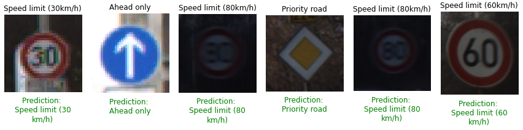

# Traffic Sign Detection

This repository contains the models trained on the German Traffic Sign Recognition Benchmark ([GTSRB](https://www.kaggle.com/datasets/meowmeowmeowmeowmeow/gtsrb-german-traffic-sign)) dataset to detect traffic signs. There are 43 types of signs in the dataset. One of the things I wanted to explore in this dataset was different image preprocessing techniques and how they lead to significantly better performances than training without image preprocessing.

The final code can be found in `final.ipynb` and the scratch/experimental code can be found in `scratch.ipynb`.

I experimented with different Convolutional-Neural-Network (CNN) models with different hyperparameters and settled on the following model with a learning rate of 0.01:

```
Model: "sequential"
_________________________________________________________________
 Layer (type)                Output Shape              Param #   
=================================================================
 conv2d (Conv2D)             (None, 32, 32, 8)         608       
                                                                 
 batch_normalization (BatchN  (None, 32, 32, 8)        32        
 ormalization)                                                   
                                                                 
 max_pooling2d (MaxPooling2D  (None, 16, 16, 8)        0         
 )                                                               
                                                                 
 conv2d_1 (Conv2D)           (None, 16, 16, 16)        1168      
                                                                 
 batch_normalization_1 (Batc  (None, 16, 16, 16)       64        
 hNormalization)                                                 
                                                                 
 conv2d_2 (Conv2D)           (None, 16, 16, 16)        2320      
                                                                 
 batch_normalization_2 (Batc  (None, 16, 16, 16)       64        
 hNormalization)                                                 
                                                                 
 max_pooling2d_1 (MaxPooling  (None, 8, 8, 16)         0         
...
Total params: 107,147
Trainable params: 106,427
Non-trainable params: 720
_________________________________________________________________
```

THe highest validation accuracy achieved by the best model during training is 94.78% so far as shown below:

```
Epoch 30/30
613/613 [==============================] - 58s 94ms/step - loss: 0.3170 - accuracy: 0.9505 - val_loss: 0.1937 - val_accuracy: 0.9478
```

Final prediction results:


